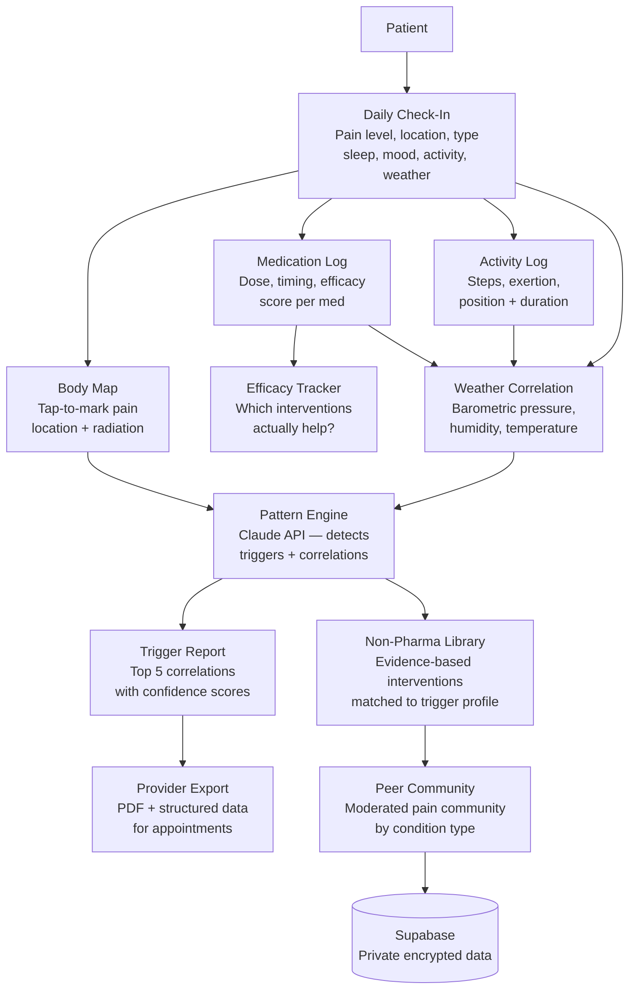

<p align="center">
  <h1 align="center">foundation-pain-compass</h1>
  <h3 align="center"><em>Chronic pain self-management. Multi-modal tracking. 50M Americans.</em></h3>
</p>

<p align="center">
  <a href="LICENSE"></a>
  
  
  <a href="https://mama.oliwoods.ai"></a>
  <a href="https://mama.oliwoods.ai/foundation"></a>
</p>

---

> *"Chronic pain affects more Americans than diabetes, heart disease, and cancer combined. Yet in a 15-minute appointment, the best a patient can do is say 'it's about a 7.' That number alone cannot drive a treatment plan. Pain Compass was built to give that number a story."*

## Why This Exists

Chronic pain is the most common reason Americans seek medical care — and one of the most poorly tracked. The standard of care (a 0-10 pain scale, a monthly check-in) generates almost no actionable data. Patients who don't track don't get believed. Patients who do track have no standardized way to share what they find.

- **50 million Americans** live with chronic pain; 20 million have high-impact chronic pain that limits daily life (CDC, 2023)
- **$635 billion/year** is the estimated economic burden of chronic pain in the U.S. (IOM, Institute of Medicine)
- **67% of chronic pain patients** report feeling dismissed or disbelieved by healthcare providers (American Chronic Pain Association, 2022)
- **Multi-modal tracking** (pain + sleep + activity + mood + weather) has been shown to identify triggers in 80% of patients within 90 days (JAMA, 2021)

Pain Compass gives patients data. Data that providers cannot dismiss.

## System Architecture



## Features

| Feature | Description | Evidence Base |
|---------|-------------|---------------|
| **Body Map Tracker** | Tap-to-mark pain location, radiation pattern, and character (burning, stabbing, aching) | McGill Pain Questionnaire |
| **Multi-Modal Daily Log** | Pain + sleep quality + mood + activity + medication + weather — all in one 90-second entry | Chronic Pain Assessment Toolbox |
| **Pattern Detection Engine** | AI identifies triggers, correlations, and trends across 30/60/90-day windows | Claude API + statistical correlation |
| **Medication Efficacy Tracker** | Logs each intervention (pharma + non-pharma) with before/after pain scores | FDA patient-reported outcomes |
| **Provider-Ready PDF** | Structured appointment summary with charts, trigger report, and medication timeline | AMA documentation standards |
| **Non-Pharma Intervention Library** | Evidence-based CBT, PT, mindfulness, heat/cold protocols matched to pain profile | APS clinical guidelines |
| **Flare Prediction** | Weather + activity pattern matching to warn of likely flare days 24-48 hours ahead | JAMA pain forecasting research |
| **Peer Community** | Moderated condition-specific community for peer support and shared strategies | ACR / chronic pain associations |

## Research Foundation

| Citation | Finding | Relevance |
|----------|---------|-----------|
| CDC (2023) | 50M Americans with chronic pain; 20M with high-impact chronic pain | Population scale |
| JAMA (2021) | Multi-modal tracking identifies triggers in 80% of patients within 90 days | Core tracking architecture |
| ACPA (2022) | 67% of patients feel dismissed by providers; documentation changes clinical outcomes | Provider export feature |
| Turk & Monarch (2019) | Cognitive-behavioral approaches reduce pain catastrophizing by 40% vs. medication alone | Non-pharma library |

## Quick Start

```bash
git clone https://github.com/OliWoods-Org/foundation-pain-compass.git
cd foundation-pain-compass
npm install
npm run dev
```

## Tech Stack

- **Runtime:** Node.js + TypeScript
- **Validation:** Zod schemas
- **Database:** Supabase (PostgreSQL, encrypted at rest)
- **AI:** Claude API (pattern detection, trigger identification)
- **Weather:** Open-Meteo API (barometric pressure, humidity, temperature)
- **Alerts:** Twilio (SMS/WhatsApp), Resend (email)

## A Note on Privacy

Every pain log in this system is private by default. No data is ever shared with insurance companies, pharmaceutical companies, or any third party without explicit user consent. The trend data you generate belongs to you and your care team alone.

## Contributing

We welcome contributions from chronic pain patients, pain psychologists, physical therapists, rheumatologists, neurologists, and developers with chronic illness. Patient perspectives are the most important input to every design decision here.

1. Fork the repo
2. Create a feature branch (`git checkout -b feat/amazing-feature`)
3. Commit your changes
4. Push and open a PR

## License

AGPL-3.0 — Free to use, modify, and distribute.

---

<p align="center">
  <strong>Built by the <a href="https://oliwoods.ai">OliWoods Foundation</a></strong><br>
  <em>Free forever. Open source. Because pain deserves more than a number out of ten.</em>
</p>
